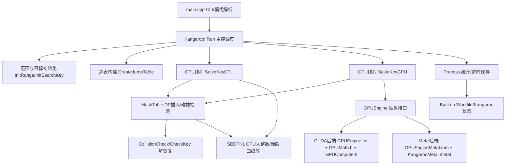

# Kangaroo 高位 BTC Puzzle（含 CPU/CUDA/Metal）源码级技术文档（代码唯一依据版）

> 说明
>
> - 本文档**仅依据源码**分析生成，未使用旧版 `README.md` / `cli.md` / `ALGORITHM_TECH_DOC.md` 等文档作为事实来源。
> - 重点覆盖你当前关心的高位 BTC puzzle（如 `puzzle135`）、`CPU/CUDA/Metal` 三种求解设备路径，以及你迁移后涉及的 >128 位距离/状态扩展。
> - 文档中的实现结论以当前仓库代码为准。

## 1. 你的 `puzzle135` 命令在代码中的真实含义（逐项映射）

你的命令：

```bash
./kangaroo -gpu -gpuId 0 -g 80,256 -d 43 -t 0 \
  -w /Users/zhaoanran/Desktop/keyhunt_2/Kangaroo/puzzle135_test.work -wi 120 -ws -wt 15000 \
  -o /Users/zhaoanran/Desktop/keyhunt_2/Kangaroo/puzzle135_result.txt \
  /Users/zhaoanran/Desktop/keyhunt_2/Kangaroo/puzzle135.txt
```

### 1.1 参数解析入口

命令行在 `Kangaroo/main.cpp` 中解析，入口 `main()` 在 `Kangaroo/main.cpp:167`。

关键参数映射（解析位置均在 `Kangaroo/main.cpp`）：

- `-gpu`：启用 GPU 路径（`gpuEnable = true`），`Kangaroo/main.cpp:285`
- `-gpuId 0`：GPU 设备列表（支持逗号分隔多卡），`Kangaroo/main.cpp:288`
- `-g 80,256`：GPU 网格尺寸列表（每卡 `x,y`），`Kangaroo/main.cpp:292` 附近（`-g` 分支）
- `-d 43`：指定 DP 位数（distinguised point bits），`Kangaroo/main.cpp:186`
- `-t 0`：CPU 线程数设为 0（即完全 GPU 跑），`Kangaroo/main.cpp:182`
- `-w`：工作文件路径，`Kangaroo/main.cpp:205`
- `-wi 120`：周期保存间隔（秒），`Kangaroo/main.cpp:242`
- `-ws`：保存 kangaroo 状态到工作文件，`Kangaroo/main.cpp:260`
- `-wt 15000`：保存时等待线程同步超时（毫秒），`Kangaroo/main.cpp:247`
- `-o`：结果输出文件（追加写），`Kangaroo/main.cpp:237`
- 最后一个参数：配置输入文件 `puzzle135.txt`，`Kangaroo/main.cpp:300` 附近

随后构造 `Kangaroo` 对象并进入 `Run()`：`Kangaroo/main.cpp:321`、`Kangaroo/main.cpp:354`。

### 1.2 `-t 0` 的实际效果（CPU 完全关闭）

在 `Kangaroo::Run()` 中：

- `nbCPUThread = nbThread`（你的命令里是 0）
- `nbGPUThread = gpuId.size()`（你的命令里为 1）

见 `Kangaroo/Kangaroo.cpp:1065` 起始处。

因此该命令会走：

- CPU 线程数 = 0
- GPU 线程数 = 1（设备 0）
- 主循环只启动 `SolveKeyGPU` 线程，不启动 `SolveKeyCPU` 线程（`Kangaroo/Kangaroo.cpp:1188` 附近）

### 1.3 `-g 80,256` 在 GPU 引擎中的真实含义

`-g x,y` 在 `Run()` 里先传入 `GPUEngine::GetGridSize()` 进行校正/默认补全（`Kangaroo/Kangaroo.cpp:1098`-`1108`）。

你明确给了 `80,256`，所以不会使用默认值。

在 GPU 线程中构造引擎：

- `GPUEngine(ph->gridSizeX, ph->gridSizeY, ph->gpuId, 65536 * 2)`
- 见 `Kangaroo/Kangaroo.cpp:579`

注意这里 `gridSizeX/gridSizeY` 在不同后端含义相同但设备实现不同：

- 都表示“GPU 后端内部线程组织参数（线程组数量/每组线程数）”
- 不是“总 kangaroo 数”，总 kangaroo 数还会乘以 `groupSize`（算法组大小）

总 kangaroo 数计算：

- `nbThread = x * y`
- `nbKangaroo = nbThread * groupSize`

见：

- CUDA：`Kangaroo/GPU/GPUEngine.cu:174`（`nbThread = nbThreadGroup * nbThreadPerGroup`）与 `Kangaroo/Kangaroo.cpp:580`
- Metal：`Kangaroo/GPU/GPUEngineMetal.mm:579`（同样定义）与 `Kangaroo/Kangaroo.cpp:580`

#### 你的命令在 Metal 下的一个关键差异

Metal 后端的 `groupSize`（算法组大小）默认不是 `GPU_GRP_SIZE=128`，而是环境变量驱动，默认 16：

- `GPUEngine::GetDefaultGroupSize()` 返回 `KANGAROO_METAL_GRP_SIZE`，默认 16，`Kangaroo/GPU/GPUEngineMetal.mm:1114`
- 构造函数也同样从环境变量读取 `groupSize`，`Kangaroo/GPU/GPUEngineMetal.mm:579`

因此在 Metal 默认配置下，你的 `-g 80,256` 对应：

- `nbThread = 80 * 256 = 20480`
- `groupSize = 16`（默认）
- `nbKangaroo = 20480 * 16 = 327680`

如果是 CUDA 后端，默认 `groupSize = GPU_GRP_SIZE = 128`（`Kangaroo/GPU/GPUEngine.cu:386`），则同样的 `-g` 会得到更大的 kangaroo 数。

### 1.4 `-d 43` 的真实 DP 判定逻辑

DP 判定函数：`Kangaroo::IsDP(uint64_t x)` 在 `Kangaroo/Kangaroo.cpp:190`。

DP mask 设置在 `Kangaroo::SetDP()`（`Kangaroo/Kangaroo.cpp:196`）：

- `dpSize = 43`
- `dMask` 被构造为“高 43 位为 1，低 21 位为 0”的 64-bit mask

CPU/GPU 都用以下逻辑判定 DP：

- 检查 `x` 坐标最高 64-bit limb（`px.bits64[3]`）
- 满足 `(px.bits64[3] & dMask) == 0`

对应位置：

- CPU：`Kangaroo/Kangaroo.cpp:494`、`Kangaroo/Kangaroo.cpp:518`
- CUDA kernel：`Kangaroo/GPU/GPUCompute.h:134` 附近（DP 分支）
- Metal kernel：`Kangaroo/GPU/KangarooMetal.metal:1683` 附近（默认核），其他变体同样逻辑

这意味着 `-d 43` 不是“全 256 位前导 43 零”，而是对 `x` 的最高 limb 进行 43-bit 前导零筛选（概率近似 `2^-43`）。

### 1.5 `-w/-wi/-ws/-wt` 的真实保存流程

你的这组参数会启用“周期性保存 workfile + 保存 kangaroo 状态”。

触发位置：

- 统计线程 `Process()` 周期性检查并调用 `SaveWork(...)`：`Kangaroo/Thread.cpp:237`、`Kangaroo/Thread.cpp:334`

保存实现位置：

- `Kangaroo::SaveWork(totalCount, totalTime, threads, nbThread)`：`Kangaroo/Backup.cpp:536`
- `Kangaroo::SaveHeader(...)`：`Kangaroo/Backup.cpp:449`
- 工作文件完整保存（含 hash table）：`Kangaroo/Backup.cpp:483`

`-wt 15000` 的作用：

- `SaveWork()` 会先置 `saveRequest=true`，等待所有求解线程在安全点阻塞（CPU/GPU 线程内部检查该标志）
- 超过 `wtimeout` 则报 `SaveWork timeout!` 并放弃本次保存
- 见 `Kangaroo/Backup.cpp:546`-`573`

`-ws` 的作用：

- 除 hash table 外，还会写出所有 kangaroo 的 `px/py/d`（以及 symmetry 模式下的 `symClass`）
- 见 `Kangaroo/Backup.cpp:612` 之后

## 2. `puzzle135.txt` 在代码中的输入格式与“位宽”语义（重要）

`puzzle135.txt` 内容（你当前文件）是三行：

1. 起始私钥范围（hex）
2. 结束私钥范围（hex）
3. 压缩公钥（目标）

解析逻辑在 `Kangaroo::ParseConfigFile()`：`Kangaroo/Kangaroo.cpp:126`。

你的 `puzzle135.txt` 为：

- `start = 0x4000...000`（即 `2^134`）
- `end   = 0x7FFF...FFF`（即 `2^135 - 1`）

这符合“135 位高位区间”直觉（候选值在 `[2^134, 2^135-1]`）。

但代码中的 `rangePower` 定义有一个细节：

- `rangeWidth = rangeEnd - rangeStart`
- `rangePower = bitlen(rangeWidth)`
- 见 `Kangaroo::InitRange()`：`Kangaroo/Kangaroo.cpp:1022`

因此对你的区间：

- 候选数量（含端点）是 `2^134`
- 但 `rangeWidth = (2^135 - 1) - 2^134 = 2^134 - 1`
- 所以 `rangePower = 134`

这会影响后续：

- 跳表平均步长目标（`CreateJumpTable()`）
- 预计复杂度估算（`ComputeExpected()`）
- DP 建议值（`suggestedDP`）

这不是错误，是该实现对“range width”的定义方式。

## 3. 项目核心架构（按源码划分）

## 3.1 模块分层总览



## 3.2 编译期与运行期后端选择

### 编译期（Makefile）

- `make gpu=1`：启用 GPU 支持（`-DWITHGPU`）
- macOS (`Darwin`)：编译 `GPU/GPUEngineMetal.mm`，定义 `-DWITHMETAL`（`Kangaroo/Makefile:54`-`58`, `Kangaroo/Makefile:107`-`108`）
- Linux/Windows CUDA 路径：编译 `GPU/GPUEngine.cu`（`Kangaroo/Makefile:111`-`115`）
- `make ... sym=1`：添加 `-DUSE_SYMMETRY`（`Kangaroo/Makefile:83`-`85`）

### 运行期（`-gpu`）

- 即使编译了 GPU 支持，也只有加 `-gpu` 才会在 `Run()` 里启动 GPU 线程
- 否则只走 CPU 路径

## 4. 求解主流程（从命令到找到私钥）

## 4.1 启动与配置加载

`main()` 完成参数解析后：

1. 初始化计时器与随机种子（`Timer::Init()` / `rseed`）
2. 初始化 secp256k1 (`Secp256K1::Init()`)
3. 构造 `Kangaroo`
4. `ParseConfigFile()` 读入范围和目标公钥
5. `Run()` 启动求解

入口与调用：

- `Kangaroo/main.cpp:167`
- `Kangaroo/main.cpp:321`
- `Kangaroo/main.cpp:343` / `:354`

## 4.2 范围归一化与目标点平移（`InitRange` / `InitSearchKey`）

### 范围初始化

`InitRange()` 负责：

- 计算 `rangeWidth = end - start`
- 计算 `rangePower = bitlen(rangeWidth)`
- 预计算 `rangeWidthDiv2 / Div4 / Div8`

见 `Kangaroo/Kangaroo.cpp:1022`。

### 对称模式下的目标点平移

`InitSearchKey()` 会将搜索问题转为以 `rangeStart` 为基准的局部问题：

- 非对称模式：目标点直接减去 `rangeStart*G`
- 对称模式：还会额外引入 `rangeWidthDiv2` 偏移（用于对称等价类处理）

代码位置：`Kangaroo/Kangaroo.cpp:1044`。

这一步直接影响后面 `CheckKey()` 的解回填逻辑（最终需要加回 `rangeStart`，对称模式还需加回 `rangeWidthDiv2`）。

## 4.3 跳表构建（Jump Table）

跳表由 `CreateJumpTable()` 构建，见 `Kangaroo/Kangaroo.cpp:887`。

### 跳表内容

- `jumpDistance[i]`：第 `i` 个跳步的标量距离
- `jumpPointx[i]`, `jumpPointy[i]`：`jumpDistance[i] * G` 的仿射坐标

### 高位 puzzle 与 `jumpBit <= 128` 的关键关系

函数中有：

- `if(jumpBit > 128) jumpBit = 128;`

这不代表不能求解 >128 位 puzzle。

原因是：

- 这里限制的是“**单次跳步的距离位宽**”
- 不是总行走距离 `d`
- 总距离通过多次跳跃累积，且你已扩展为 192-bit 距离编码（见后文）

### 对称模式跳表的额外结构

`USE_SYMMETRY` 下：

- 跳表分成两半（`NB_JUMP/2` + `NB_JUMP/2`）
- 通过两个素数 `u/v` 构造两组跳距分布
- 实际使用哪一半由 `symClass` 决定

对应代码仍在 `Kangaroo/Kangaroo.cpp:887` 内。

## 4.4 DP 参数与复杂度估计

`ComputeExpected()` 在 `Kangaroo/Kangaroo.cpp:981`，用于估算：

- 预期操作量 `expectedNbOp`
- 预期 RAM `expectedMem`
- DP overhead

`Run()` 里会根据 `rangePower` 和总 kangaroo 数自动给出建议 DP：

- `suggestedDP = rangePower/2 - log2(totalRW)`（随后按 overhead 调整）
- 见 `Kangaroo/Kangaroo.cpp:1131`-`1146`

你显式给了 `-d 43`，因此最终使用 `SetDP(43)`，不会采用建议值。

## 4.5 初始 herd（袋鼠群）生成

`CreateHerd()` 在 `Kangaroo/Kangaroo.cpp:815`。

核心步骤：

1. 为每个 kangaroo 选择随机起始距离 `d`
2. 将 `d` 转为点 `d*G`
3. 若是 wild，则加上目标点 `Q`（`keyToSearch`）形成 `Q + dG`
4. 写入 `px/py/d`
5. 对称模式下根据 `y` 符号归一化并切换 `symClass`

### Tame / Wild 初始距离分布（代码定义）

- 非对称模式：
  - Tame：`d ∈ [0, N]`
  - Wild：`d ∈ [-N/2, N/2]`
- 对称模式：
  - Tame：`d ∈ [0, N/2]`
  - Wild：`d ∈ [-N/4, N/4]`

这直接体现在 `CreateHerd()` 的条件分支里（`Kangaroo/Kangaroo.cpp:835` 附近）。

## 5. CPU 求解路径（`SolveKeyCPU`）

CPU 主循环在 `Kangaroo::SolveKeyCPU()`，起始于 `Kangaroo/Kangaroo.cpp:387`。

## 5.1 CPU 的核心优化结构：一线程同时推进 1024 只 kangaroo

构造函数里 `CPU_GRP_SIZE = 1024`（`Kangaroo/Kangaroo.cpp:102` 附近）。

CPU 线程并不是“一次只算 1 只”，而是批量处理 `CPU_GRP_SIZE`：

- 先批量计算所有 `dx = x - jumpX`
- 用 `IntGroup::ModInv()` 做一次批量模逆（前缀积/后缀积法）
- 再逐只完成点加和距离更新

相关代码：

- `SolveKeyCPU()`：`Kangaroo/Kangaroo.cpp:387`
- `IntGroup::ModInv()`：`Kangaroo/SECPK1/IntGroup.cpp:36`

这与 GPU 中“批量模逆”思想是同构的。

## 5.2 CPU 随机步推进公式（仿射点加）

CPU 每步使用仿射坐标点加，流程在 `SolveKeyCPU()` 主循环中：

1. 选跳步 `jmp`
2. `dx = px - jumpPointx[jmp]`
3. 批量求逆 `dx^{-1}`
4. `s = (py - jy) / (px - jx)`
5. `rx = s^2 - jx - px`
6. `ry = s(px - rx) - py`
7. `d += jumpDistance[jmp]`

对应代码：`Kangaroo/Kangaroo.cpp:431`-`489`。

底层公式与 `Secp256K1::AddDirect()`（`Kangaroo/SECPK1/SECP256K1.cpp:238`）一致。

## 5.3 对称模式（`USE_SYMMETRY`）下的 CPU 行为

在 CPU 端，对称模式有三处关键变化：

1. 跳步选择不是直接 `x % NB_JUMP`
   - 而是根据 `symClass` 选择半张跳表
2. 每次步进后若 `ry` 被 `ModPositiveK1()` 归一化为正号
   - 则 `d` 取模阶相反数（`ModNegK1order()`）
   - `symClass` 翻转
3. `wildOffset` 不再使用（GPU 端也同理）

代码位置：

- CPU 跳步索引：`Kangaroo/Kangaroo.cpp:431` / `:446`
- 对称翻转：`Kangaroo/Kangaroo.cpp:478`-`485`

## 5.4 CPU 路径的 DP 处理与碰撞检测

CPU 每轮推进后：

- 检查 `IsDP(px[g].bits64[3])`
- 如果命中 DP：调用 `AddToTable(...)`
- 若为同 herd 冲突/重复，则重置该 kangaroo（`CreateHerd(1,...)`）

代码：

- DP 检测：`Kangaroo/Kangaroo.cpp:518`
- 插表与碰撞：`Kangaroo/Kangaroo.cpp:523`
- 重置：`Kangaroo/Kangaroo.cpp:526`

## 6. GPU 求解路径总览（`SolveKeyGPU`）

GPU 主循环在 `Kangaroo::SolveKeyGPU()`，起始于 `Kangaroo/Kangaroo.cpp:566`。

## 6.1 GPU 路径与 CPU 路径的统一点

GPU 只负责：

- 批量推进 kangaroo
- 输出命中的 DP（`x,d,kIdx`）

真正的碰撞逻辑仍然在 CPU 主控里统一处理：

- `AddToTable()`
- `CollisionCheck()`
- `CheckKey()`

这样 CPU / CUDA / Metal 都共享同一套解恢复和碰撞验证逻辑。

## 6.2 GPU 初始 herd 布局与 `kIdx % 2` herd 类型一致性

`SolveKeyGPU()` 内有一个很重要的布局修正逻辑（`Kangaroo/Kangaroo.cpp:599`-`621`）：

- GPU 内部 walker 索引是 `[block][g][t]`
- 碰撞阶段用 `kIdx % 2` 来区分 tame / wild
- 因此初始化时要保证该全局索引奇偶性与 herd 类型一致

代码注释明确写了这点（`Kangaroo/Kangaroo.cpp:599` 附近）。

这是你迁移和扩展后非常关键的一致性约束，尤其在 CUDA/Metal 后端共享 `kIdx` 语义时。

## 6.3 `wildOffset`：非对称与对称路径的差异

GPU 在非对称模式下，为了和 CPU 路径统一，会在设备侧将 wild 距离存成“带偏移”的形式：

- `wildOffset = rangeWidthDiv2`

而在对称模式下：

- `wildOffset = 0`

原因是对称模式使用“带符号距离 + symClass 切换”，固定 offset 会破坏符号翻转等价关系。

设置代码：`Kangaroo/Kangaroo.cpp:627`-`635`。

## 6.4 GPU 求解主循环（host 侧）

GPU 线程循环结构：

1. `gpu->Launch(gpuFound)` 获取上次 kernel 的 DP 并提交下一次 kernel
2. 累加计数器（按 `GetRunCount()`）
3. 遍历 `gpuFound`，逐个 `AddToTable()`
4. 同 herd 冲突则 `gpu->SetKangaroo(...)` 重置该 walker

见 `Kangaroo/Kangaroo.cpp:668`-`779`。

## 7. 碰撞、解恢复与哈希表（核心逻辑）

## 7.1 `HashTable` 存什么，不存什么

哈希表定义在 `Kangaroo/HashTable.h`，核心结构：

- `ENTRY.x`：只存 `x` 的低 128 位（`int128_t`）
- `ENTRY.d`：存 192-bit 压缩距离（`int192_t`）

定义与注释：

- `Kangaroo/HashTable.h:55`（`int192_t`）
- `Kangaroo/HashTable.h:64`（`d` 的位布局注释）

并通过 hash bucket 补充一部分 x 信息：

- `h = x.bits64[2] & HASH_MASK`
- `HASH_SIZE = 2^18`

见：

- `Kangaroo/HashTable.h:28`-`29`
- `Kangaroo/HashTable.cpp:82`（`Convert()`）

这是一种典型的“DP 表压缩”设计，降低内存占用。

## 7.2 192-bit 距离编码（你高位扩展的核心之一）

`HashTable::Convert()` / `CalcDistAndType()` 完成编码与解码：

- `HashTable::Convert()`：`Kangaroo/HashTable.cpp:82`
- `HashTable::CalcDistAndType()`：`Kangaroo/HashTable.cpp:258`

编码格式（`int192_t d`）:

- `i64[2] bit63`：符号位（distance sign）
- `i64[2] bit62`：kangaroo 类型（tame/wild）
- 其余 `190` 位：距离绝对值（magnitude）

这也是 `Kangaroo/HashTable.h:64` 注释写明的格式。

### 为什么这能支持 >128 位 puzzle

因为袋鼠算法需要长期累积行走距离，`d` 很容易超过 128 位；你当前代码已将：

- DP 表中的距离存储
- 网络传输 DP（`Kangaroo.h` 的 `DP.d`）
- workfile 存盘/恢复相关路径
- GPU/Metal 设备侧距离表示（对称路径）

统一提升到了 192-bit 压缩距离格式。

相关位置：

- `Kangaroo/Kangaroo.h:100`（网络 DP 结构中的 `int192_t d`）
- `Kangaroo/Backup.cpp:449`（workfile header version）
- `Kangaroo/Check.cpp:493` 附近（`Dist192 self-test`）

## 7.3 `AddToTable()` 与碰撞类型

`Kangaroo::AddToTable(...)` 有两条入口：

- CPU 路径（传 `Int* pos, Int* dist, kType`），`Kangaroo/Kangaroo.cpp:359`
- GPU/网络路径（传压缩 `h, x128, d192`），`Kangaroo/Kangaroo.cpp:369`

底层 `HashTable::Add()` 返回三类状态：

- `ADD_OK`
- `ADD_DUPLICATE`
- `ADD_COLLISION`

定义在 `Kangaroo/HashTable.h:31`-`33`。

哈希桶内部采用按 `x128` 排序的数组 + 二分插入（`Kangaroo/HashTable.cpp:272` 起）。

## 7.4 `CollisionCheck()` 与 `CheckKey()` 解恢复链

碰撞发生后，流程为：

1. 区分 tame / wild（同 herd 冲突直接忽略）
2. 尝试 4 种等价情况（符号翻转组合）
3. 若命中目标公钥或其负点，回填区间偏移，输出私钥

代码：

- `CollisionCheck()`：`Kangaroo/Kangaroo.cpp:289`
- `CheckKey()`：`Kangaroo/Kangaroo.cpp:252`

`CheckKey()` 中会：

- 根据 `type` 决定是否对 `d1/d2` 做 `ModNegK1order()`
- `pk = d1 + d2 (mod n)`
- 验证 `pk*G` 是否等于 `keyToSearch` 或 `keyToSearchNeg`
- 最终加回 `rangeStart`（以及对称模式下 `rangeWidthDiv2`）

这是最终私钥恢复的核心代码路径。

## 8. 高位 puzzle（>128 位）支持的关键扩展点（代码级总结）

这是与你改造目标最相关的一章。

## 8.1 扩展点 1：距离从 128-bit 提升到 192-bit（压缩格式）

核心体现：

- `int192_t` 定义与注释：`Kangaroo/HashTable.h:55` / `:64`
- `HashTable::Convert` 和 `CalcDistAndType`：`Kangaroo/HashTable.cpp:82`, `:258`
- 网络 DP 结构 `DP.d`：`Kangaroo/Kangaroo.h:100`

这使得 DP 表和网络通信不再被 128-bit 距离限制卡死。

## 8.2 扩展点 2：workfile 版本升级与兼容性保护

workfile 头版本在 `SaveHeader()` 中写入，`Kangaroo/Backup.cpp:449`：

- `version = 2`：192-bit distance 格式（symmetry 路径）
- 非对称路径也通过 `version = 1` 标记升级后的格式（代码注释说明）

`LoadWork()` 会根据版本做兼容性检查，旧版直接拒绝或警告：

- `Kangaroo/Backup.cpp:149` 起
- 包括对 symmetry/non-symmetry 的版本差异处理

这避免了旧 workfile 与新距离格式混用造成 silent corruption。

## 8.3 扩展点 3：GPU/Metal 对称路径采用 192-bit 有符号距离

### CUDA

- 设备端 192-bit 距离运算：`DistAddSigned192` / `DistToggleSign192`
  - `Kangaroo/GPU/GPUMath.h:575`, `:632`
- Host-device 编码解码：`EncodeGpuDistanceSym` / `DecodeGpuDistanceSym`
  - `Kangaroo/GPU/GPUEngine.h:46`, `:75`

### Metal

- Shader 端 192-bit 距离运算：`dist_add_signed_192` / `dist_toggle_sign_192`
  - `Kangaroo/GPU/KangarooMetal.metal:793`, `:837`
- Host 侧仍复用 `GPUEngine.h` 中的 `EncodeGpuDistanceSym/DecodeGpuDistanceSym`
  - `Kangaroo/GPU/GPUEngineMetal.mm:1176`（上传）
  - `Kangaroo/GPU/GPUEngineMetal.mm:1380`（回读）

## 8.4 扩展点 4：对称模式下显式位宽上限保护（192-bit 距离约束）

在 `InitRange()` 中，对 `USE_SYMMETRY` 有明确保护：

- `if(rangePower - 1 > 190) FATAL...`

代码位置：`Kangaroo/Kangaroo.cpp:1034` 附近。

这说明对称模式下的 signed-magnitude 192-bit 距离格式是硬约束之一（可表示 190-bit magnitude + sign/type bits）。

对你的 `puzzle135` 来说，这个限制远未触及。

## 8.5 扩展点 5：192-bit 距离自测

`Check.cpp` 中有专门的 `Dist192 self-test`：

- `RunDist192SelfTest()` / `CheckDistEncodeDecodeCase()`
- 入口在 `Kangaroo::Check()` 中调用

位置：

- `Kangaroo/Check.cpp:30` 附近（辅助函数）
- `Kangaroo/Check.cpp:493`（`Check()`）

这对验证迁移后 CPU/GPU/存盘编码一致性非常关键。

## 9. CUDA 后端深度剖析（`GPUEngine.cu` / `GPUCompute.h` / `GPUMath.h`）

## 9.1 CUDA 端总体架构

CUDA 后端由三层组成：

1. `GPUEngine.cu`：Host 侧资源管理、kernel 调度、DP 输出解析
2. `GPUCompute.h`：kernel 主循环逻辑（行走/点加/DP 输出）
3. `GPUMath.h`：底层有限域运算、大整数、模逆、距离运算（含 PTX inline asm）

主 kernel 包装入口：

- `comp_kangaroos`：`Kangaroo/GPU/GPUEngine.cu:35`
- 调用 `ComputeKangaroos(...)`：`Kangaroo/GPU/GPUCompute.h:41`

## 9.2 CUDA 的 kangaroo 状态内存布局（核心）

`KSIZE` 定义在 `Kangaroo/GPU/GPUEngine.h`：

- 非对称：`KSIZE = 11`（x4 + y4 + d3）
- 对称：`KSIZE = 12`（再加 `symClass`）

定义位置：`Kangaroo/GPU/GPUEngine.h:26`-`28`。

实际布局是 AoSoA（按 `[block][g][field][t]` 索引）：

- `g`：算法组内 walker 索引（`0..GPU_GRP_SIZE-1`）
- `t`：block 内 CUDA thread 索引（`0..blockDim.x-1`）

`GPUEngine.cu` / `GPUMath.h` 中多处按以下索引访问：

- `stride = g * KSIZE * blockDim.x`
- `fieldOffset * blockDim.x + IDX + stride`

相关代码：

- `Kangaroo/GPU/GPUMath.h:196`（`LoadKangaroos`）
- `Kangaroo/GPU/GPUMath.h:279`（`StoreKangaroos`）
- `Kangaroo/GPU/GPUEngine.cu:447`（host 端镜像写入布局）

字段顺序：

- `[0..3]` x limbs
- `[4..7]` y limbs
- `[8..10]` d limbs（192-bit/128+）
- `[11]` symClass（仅 `USE_SYMMETRY`）

## 9.3 CUDA kernel 主循环（`ComputeKangaroos`）

`ComputeKangaroos()` 在 `Kangaroo/GPU/GPUCompute.h:41`。

每次 kernel launch 内部执行 `NB_RUN` 次迭代（常量 `NB_RUN=64`，`Kangaroo/Constants.h:35`）：

1. 从设备内存载入本线程负责的 `GPU_GRP_SIZE` 个 kangaroo
2. 计算每只 `dx = px - jPx[j]`
3. `_ModInvGrouped(dx)` 批量求逆
4. 执行仿射点加更新 `(px,py)`
5. 更新距离 `dist`
6. 判断 DP，写入 `out` buffer
7. 循环完成后写回所有状态

关键位置：

- `_ModInvGrouped(dx)`：`Kangaroo/GPU/GPUCompute.h:78`
- 点加主链：`Kangaroo/GPU/GPUCompute.h:111`-`118`
- 对称距离更新：`Kangaroo/GPU/GPUCompute.h:125`-`127`
- DP 输出：`Kangaroo/GPU/GPUCompute.h:134`-`141`

### 零分母 fallback（避免奇异点）

若 `px == jumpX[j]` 导致 `dx=0`：

- 改用下一个跳步 `jAlt`
- 若 `jAlt` 仍导致零分母则跳过该步

代码：`Kangaroo/GPU/GPUCompute.h:86`-`108`。

这与 `Check.cpp` 中 CPU 复现 GPU 行为的逻辑是一致的（`Kangaroo/Check.cpp:648` 附近）。

## 9.4 CUDA 的 DP 输出格式（设备 -> Host）

输出 buffer 是一个 `uint32_t` 数组：

- 第 1 个 word：计数器 `nbFound`
- 每个 DP 项固定 16 个 `uint32_t`（即 64 bytes）

常量：

- `ITEM_SIZE = 64`，`Kangaroo/GPU/GPUEngine.h:31`
- `OutputDP` 宏：`Kangaroo/GPU/GPUMath.h:174`

每项内容顺序：

- `x`：8 个 `uint32_t`（即 256-bit x）
- `d`：6 个 `uint32_t`（即 192-bit d）
- `kIdx`：2 个 `uint32_t`（64-bit）

Host 解析在 `GPUEngine::Launch()`：`Kangaroo/GPU/GPUEngine.cu:725`。

## 9.5 CUDA Host 侧调度与流水化

`GPUEngine::Launch()` 的设计是“消费上一次 kernel 结果 + 提交下一次 kernel”：

- 先读取 output（异步轮询前 4 bytes 避免 CPU 100% spin）
- 解析 DP 列表
- `return callKernel()` 提交下一轮

代码：`Kangaroo/GPU/GPUEngine.cu:725`-`801`。

因此在 `SolveKeyGPU()` 里，首次会先 `callKernel()`，然后循环调用 `Launch()`。

## 9.6 CUDA 底层算术与指令级优化（PTX）

`Kangaroo/GPU/GPUMath.h` 是 CUDA 算术核心，含大量 PTX inline asm 宏：

- `mul.lo.u64`, `mul.hi.u64`
- `mad.hi`, `madc.hi`
- `add.cc`, `addc`, `sub.cc`, `subc`

宏定义位置：`Kangaroo/GPU/GPUMath.h:28`-`48`（`UMULLO/UMULHI/MAD*` 等）。

关键函数：

- `_ModInv`（模逆，延迟右移 divstep 类实现）：`Kangaroo/GPU/GPUMath.h:820`
- `_ModMult`（模乘）：`Kangaroo/GPU/GPUMath.h:930` / `:981`
- `_ModSqr`（模平方）：`Kangaroo/GPU/GPUMath.h:1029`
- `_ModInvGrouped`（批量模逆）：`Kangaroo/GPU/GPUMath.h:1286`

### 约减常数与 secp256k1 素域特化

CUDA 与 CPU 一样利用 secp256k1 素数结构：

- `p = 2^256 - 0x1000003D1`

因此在 512->320->256 的约减中反复使用常数 `0x1000003D1`，见 `_ModMult/_ModSqr`。

这与你提到的“指令集优化 + 核心算法优化”高度一致：它不是通用大数库，而是针对 secp256k1 做了强特化。

## 10. Metal 后端深度剖析（迁移重点）

## 10.1 Metal 端总体架构

Metal 后端同样保持 `GPUEngine` 接口，但内部实现换成：

- `GPUEngineMetal.mm`：ObjC++ Host 侧引擎
- `KangarooMetal.metal`：MSL shader（多个 kernel 变体）

这使上层 `Kangaroo::SolveKeyGPU()` 无需修改调用协议（`SetParams/SetKangaroos/Launch/GetKangaroos`）。

## 10.2 Metal Host 引擎关键设计（`GPUEngineMetal.mm`）

### 统一参数结构（Host/Shader 对齐）

`KernelParams` 在 Host/Shader 两侧都定义，并显式保留 `paramPad` 防止 `dpMask` 偏移不一致：

- Host：`Kangaroo/GPU/GPUEngineMetal.mm:53`
- Shader：`Kangaroo/GPU/KangarooMetal.metal:53`

这类“结构体 ABI 对齐”是 Metal 迁移中常见坑点，你这里已经显式处理。

### 引擎构造与资源分配

`GPUEngine::GPUEngine(...)`（Metal 版）在 `Kangaroo/GPU/GPUEngineMetal.mm:579`：

- 枚举 `MTLDevice`
- 创建 `MTLCommandQueue`
- 构建 `MTLComputePipelineState`
- 分配 `kangarooBuffer` / `outputBuffers[2]` / `jump*Buffer`
- 分配 host staging 内存

### 网格默认值（Metal）

`GetGridSize()`：`Kangaroo/GPU/GPUEngineMetal.mm:824`

默认策略（当 `-g` 未指定时）：

- `y` 默认倾向 256（受设备 `maxThreadsPerThreadgroup` 限制）
- `x` 默认 64

### 算法组大小与 `NB_RUN` 的 Metal 特化

- `groupSize` 默认 16（`KANGAROO_METAL_GRP_SIZE`），`Kangaroo/GPU/GPUEngineMetal.mm:579`, `:1114`
- `runCount` 默认 4（`KANGAROO_METAL_NB_RUN`），`Kangaroo/GPU/GPUEngineMetal.mm:579`

这和 CUDA 的固定 `GPU_GRP_SIZE=128`、`NB_RUN=64` 是显著差异。

## 10.3 Metal 的 `stateCache` 模式体系（你迁移后的核心优化框架）

### 模式定义与名称映射

`GetStateCacheMode()` 和 `GetStateCacheKernelName()`：

- `Kangaroo/GPU/GPUEngineMetal.mm:204`
- `Kangaroo/GPU/GPUEngineMetal.mm:257`

模式映射：

- `0` = full cache（`kangaroo_step`）
- `1` = no cache（`kangaroo_step_nocache`）
- `2` = px cache（`kangaroo_step_nocache_pxcache`）
- `3` = d cache（`kangaroo_step_nocache_dcache`）
- `4` = simd cooperative inversion（`kangaroo_step_simd_inv`）
- `5` = jacobian mixed prototype（`kangaroo_step_jacobian_mixed`）

### 自动模式 1/4 选择（Benchmark）

Metal 构造函数支持自动在 `none(1)` 与 `simd(4)` 之间基准选择：

- 构建双 pipeline
- 上传 kangaroo 后做 warmup + benchmark
- 比较吞吐后选择最终 mode

逻辑集中在 `SetKangaroos()` 后半段：`Kangaroo/GPU/GPUEngineMetal.mm:1176`-`1367`。

这部分就是你“核心算法优化”在 Metal 的一个很清晰的框架化落地。

## 10.4 Metal `Launch()` 的流水化优化（重要）

`GPUEngine::Launch()`（Metal）在 `Kangaroo/GPU/GPUEngineMetal.mm:1646`。

你这里做了一个关键优化（代码注释也写明了）：

- **先提交下一次 kernel，再等待上一次 kernel 完成**
- 实现真正 GPU-CPU 并行重叠

配合 `callKernel()` 中去掉 `WaitForInflight()`（`Kangaroo/GPU/GPUEngineMetal.mm:1513`-`1526`）形成完整流水线。

这比 CUDA 路径的“先等再发”更激进，尤其适合 Metal/共享内存缓冲模型。

## 10.5 Metal 默认 kernel（`kangaroo_step`）执行流程

默认 kernel 在 `Kangaroo/GPU/KangarooMetal.metal:1511`。

执行过程与 CUDA 同构，但做了 Metal 适配：

1. 将 `jumpD/jumpX/jumpY` 先搬入 `threadgroup` 内存（`tgJump*`）
2. 每个 Metal thread 负责 `kGpuGroupSize` 只 kangaroo
3. 本地缓存 `px/py/d`（full cache 模式）
4. 每轮 `run`：
   - 计算 `dx`
   - `mod_inv_grouped()` 批量逆
   - 仿射点加
   - 距离累加
   - DP 输出
5. 整个 launch 完成后一次性写回状态

关键位置：

- 跳表搬运到 `threadgroup`：`Kangaroo/GPU/KangarooMetal.metal:1525`-`1548`
- 本地缓存加载：`Kangaroo/GPU/KangarooMetal.metal:1575`-`1598`
- 批量逆调用：`Kangaroo/GPU/KangarooMetal.metal:1609` / `:1621`
- 对称距离 192-bit 累加：`Kangaroo/GPU/KangarooMetal.metal:1655`-`1658`
- DP 输出：`Kangaroo/GPU/KangarooMetal.metal:1670` 附近
- 写回状态：`Kangaroo/GPU/KangarooMetal.metal:1710`-`1727`

## 10.6 Metal 的 192-bit 距离与对称逻辑

### 跳步索引（对称模式）

- `jump_index_sym()`：`Kangaroo/GPU/KangarooMetal.metal:89`
- `jump_next_sym()`：`Kangaroo/GPU/KangarooMetal.metal:95`

### 192-bit signed distance 运算

- `dist_add_signed_192()`：`Kangaroo/GPU/KangarooMetal.metal:793`
- `dist_toggle_sign_192()`：`Kangaroo/GPU/KangarooMetal.metal:837`

这与 CUDA `DistAddSigned192/DistToggleSign192` 的语义保持一致，只是实现语言换成 MSL。

### Host 侧一致性桥接

Metal Host 上传/回读 kangaroo 状态时仍调用 `EncodeGpuDistanceSym/DecodeGpuDistanceSym`（定义在 `GPUEngine.h`），确保与 CUDA/CPU 编码协议一致：

- 上传：`Kangaroo/GPU/GPUEngineMetal.mm:1176`
- 回读：`Kangaroo/GPU/GPUEngineMetal.mm:1380`
- DP 输出解码：`Kangaroo/GPU/GPUEngineMetal.mm:1715` 之后

## 10.7 Metal 的底层算术与优化策略（指令/实现层）

### 乘法实现：32-bit 分块优先，可切换 native wide mul

`KangarooMetal.metal` 提供：

- `mul64wide_u32()`（32-bit 分块拼 64x64->128），`Kangaroo/GPU/KangarooMetal.metal:97` 附近
- 可通过宏切换 native wide mul / unsigned mulhi
- `kReduceC = 0x1000003D1` 的特化约减路径

这与 CUDA/CPU 一样，依旧是 secp256k1 素域强特化路线。

### 模逆实现分层

关键函数：

- `mod_inv_pow_k1()`：`Kangaroo/GPU/KangarooMetal.metal:1048`
- `mod_inv_k1()`：`Kangaroo/GPU/KangarooMetal.metal:1128`
- `mod_inv_grouped()`：`Kangaroo/GPU/KangarooMetal.metal:1198` / `:1321`
- `mod_inv_grouped_simd()`：`Kangaroo/GPU/KangarooMetal.metal:1237` / `:1332`

你这里不仅做了 grouped inversion，还加入了 simdgroup 协作逆元路径（mode 4）。

### SIMD cooperative inversion（mode 4）

`kangaroo_step_simd_inv` 在 `Kangaroo/GPU/KangarooMetal.metal:2310`。

特点：

- 每个线程仍处理 `kGpuGroupSize` 只 kangaroo
- 但 32 lanes 用 simd shuffle 做前缀/后缀积扫描
- 只做一次逆元，再散射回各 lane

这是一种高价值优化，目的是减少模逆次数和 threadgroup scratch 压力。

### Jacobian mixed prototype（mode 5）

`kangaroo_step_jacobian_mixed` 在 `Kangaroo/GPU/KangarooMetal.metal:2041`。

设计目标：

- launch 内部用 Jacobian 保存 kangaroo 状态，减少每步点加中的逆元需求
- 每轮只在需要 jump/DP 时归一化到 affine
- 最后写回 affine 以保持 Host/CPU 协议不变

但 `GPUEngineMetal.mm` 中对 `USE_SYMMETRY` 显式限制：

- symmetry 下 mode 5 退回 mode 1（`Kangaroo/GPU/GPUEngineMetal.mm:639`-`641`）

说明该原型路径在 symmetry 兼容性上仍被保守处理。

## 11. CPU 底层：SECPK1 大整数与椭圆曲线实现（源码级）

## 11.1 `Int` 的数据布局与位宽能力

`Int` 定义在 `Kangaroo/SECPK1/Int.h:40`。

当前 `BISIZE = 256`，但 `NB64BLOCK = 5`（`Kangaroo/SECPK1/Int.h:31`），即：

- 256-bit 主体 + 1 个额外 64-bit limb
- 用于 Knuth 除法、Montgomery、ModInv 等中间过程（源码注释已说明）

这解释了为什么 CPU 端很多算法使用 320-bit signed 中间态（例如 `ModInv`）。

## 11.2 CPU 指令级兼容/优化层（x86_64 与 ARM64）

`Int.h` 中做了平台分支：

### ARM64（Apple Silicon）

- `_umul128` / `_mul128` / `_udiv128` 用 `__int128` / `__uint128_t` 实现
- `__rdtsc()` 使用 `mrs cntvct_el0`
- `_addcarry_u64` / `_subborrow_u64` 用 `__int128` 模拟

位置：`Kangaroo/SECPK1/Int.h:218`-`256`。

这正是你从 CUDA 迁移到 Metal（Apple 平台）时 CPU 辅助路径可持续工作的关键基础。

### x86_64

- `mulq` / `imulq` / `divq` 内联汇编
- `rdtsc`
- `__builtin_ia32_addcarryx_u64` / `sbb`

位置：`Kangaroo/SECPK1/Int.h:267`-`299`。

## 11.3 CPU 模逆：`DivStep62` + Delayed Right Shift（DRS62）

`Int::ModInv()` 在 `Kangaroo/SECPK1/IntMod.cpp:317`，实际启用的是 `DRS62` 路径（代码中宏选择）。

关键点：

- `DivStep62()`：`Kangaroo/SECPK1/IntMod.cpp:131`
- 采用 62-bit delayed right shift 的 divstep 风格算法
- 代码注释中明确提到基于 Pornin 方法（变时实现）
- 旧 SSE2 方案被保留但禁用，并注明 ARM64 不可用

`DivStep62()` 中的 ARM64 兼容注释也说明你这份代码已经针对 Apple 平台做过移植整理。

## 11.4 CPU secp256k1 素域模乘/模平方特化

### `ModMulK1`

- `Int::ModMulK1(Int *a, Int *b)`：`Kangaroo/SECPK1/IntMod.cpp:822`
- `Int::ModMulK1(Int *a)`：`Kangaroo/SECPK1/IntMod.cpp:901`

实现特征：

- 手写 256x256 -> 512 乘法（carry chain + `_umul128`）
- 使用 `0x1000003D1` 做两段约减（512->320->256）
- 明显针对 secp256k1 素数 `2^256 - 0x1000003D1` 特化

### `ModSquareK1`

- `Int::ModSquareK1(Int *a)`：`Kangaroo/SECPK1/IntMod.cpp:979`

实现特征：

- 展开平方项、复用对称项，减少乘法次数
- 同样使用 `0x1000003D1` 约减链

这与 CUDA/Metal 后端在数学层是同一套路，只是实现语言和指令级细节不同。

## 11.5 模阶（order）上的加减/取负：高位 puzzle 距离逻辑的 CPU 基础

这些函数是高位 puzzle 距离和对称逻辑的基础：

- `InitK1(order)`：`Kangaroo/SECPK1/IntMod.cpp:1189`
- `ModAddK1order`：`Kangaroo/SECPK1/IntMod.cpp:1194`, `:1201`
- `ModSubK1order`：`Kangaroo/SECPK1/IntMod.cpp:1208`
- `ModNegK1order`：`Kangaroo/SECPK1/IntMod.cpp:1214`
- `ModPositiveK1`：`Kangaroo/SECPK1/IntMod.cpp:1219`

其中 `ModPositiveK1()` 会在“值 / 其模负值”之间选择更短表示，并在需要时就地替换为负值，这正是对称模式翻转 `d` 时 CPU 端的核心语义基础。

## 11.6 椭圆曲线群运算组织（`SECP256K1.cpp`）

关键函数：

- `Secp256K1::Init()`（生成元表 `GTable`）：`Kangaroo/SECPK1/SECP256K1.cpp:25`
- `ComputePublicKey()`：`Kangaroo/SECPK1/SECP256K1.cpp:59`
- `ComputePublicKeys()`（批量版本 + `IntGroup::ModInv`）：`Kangaroo/SECPK1/SECP256K1.cpp:89`
- `AddDirect()`（仿射+仿射）：`Kangaroo/SECPK1/SECP256K1.cpp:238`
- `Add2()`（Jacobian + affine）：`Kangaroo/SECPK1/SECP256K1.cpp:325`
- `Add()`（Jacobian + Jacobian）：`Kangaroo/SECPK1/SECP256K1.cpp:369`
- `DoubleDirect()`：`Kangaroo/SECPK1/SECP256K1.cpp:438`
- `Double()`：`Kangaroo/SECPK1/SECP256K1.cpp:468`

在袋鼠主循环中，CPU 端主要用的是仿射增量更新（对应 `AddDirect()` 的公式链），并借助 `IntGroup::ModInv` 摊薄模逆成本。

## 12. Workfile / 恢复机制（与你命令强相关）

## 12.1 文件头类型与版本

在 `Kangaroo/Kangaroo.h` 中定义：

- `HEADW`：完整工作文件（hash table + 可选 kangaroos）`Kangaroo/Kangaroo.h:121`
- `HEADK`：仅 kangaroo 文件 `Kangaroo/Kangaroo.h:122`
- `HEADKS`：压缩 kangaroo 文件 `Kangaroo/Kangaroo.h:123`

## 12.2 加载流程（`-i`）

`LoadWork()`：`Kangaroo/Backup.cpp:149`

会恢复：

- DP 位数、范围、目标公钥、累计计数/时间
- hash table
- kangaroo 状态数量（随后由 `FectchKangaroos()` 分配到 CPU/GPU 线程）

## 12.3 kangaroo 状态恢复分配（CPU/GPU 混合）

`FectchKangaroos()`（注意原代码拼写）在 `Kangaroo/Backup.cpp:342`：

- 先按 CPU 线程分配 `CPU_GRP_SIZE`
- 再按每个 GPU 线程的 `nbKangaroo` 分配
- 不足部分用 `CreateHerd()` 新建

这保证了恢复后的运行布局与当前线程/设备配置一致。

## 12.4 周期保存的线程同步机制

求解线程（CPU/GPU）在主循环中都检查 `saveRequest`：

- CPU：`Kangaroo/Kangaroo.cpp:541`
- GPU：`Kangaroo/Kangaroo.cpp:750`

当主线程触发保存时：

- 所有线程在安全点标记 `isWaiting=true`
- `SaveWork()` 等待全部进入等待状态后再写盘
- 超时由 `-wt` 控制

这是一个较稳妥的“协作式快照”机制。

## 13. CPU / CUDA / Metal 一致性校验链（迁移验证建议）

`Kangaroo::Check()` 在 `Kangaroo/Check.cpp:493`，主要做三类校验：

1. CPU 批量公钥计算一致性
   - `ComputePublicKey` vs `ComputePublicKeys`
2. `Dist192 self-test`
   - 验证距离编码/解码一致性
3. GPU 校验（启用 GPU 时）
   - Metal unit tests（若 `WITHMETAL`）
   - GPU/CPU 行走结果对齐检查（包括 DP 输出与 `kIdx` 对应）

其中 Metal 单元测试入口：

- `GPUEngine::RunUnitTests(...)` 在 `Kangaroo/GPU/GPUEngineMetal.mm:893`

这套 `-check` 路径对你后续继续迭代 Metal 内核（尤其是 stateCache / simd / jacobian 模式）非常有价值。

## 14. 你当前 `puzzle135` 场景下的实现级结论（结合代码）

## 14.1 结论 1：高位 puzzle（135）在当前架构上是“距离扩展”问题，不是“单步位宽”问题

- `CreateJumpTable()` 的 `jumpBit <= 128` 限制的是单跳大小
- 你扩展后的关键能力是 `d` 的 192-bit 压缩存储与 GPU/Metal 同步实现
- 因此 `puzzle135` 这类区间完全可由当前代码表示与恢复

## 14.2 结论 2：你的 Metal 迁移不是简单翻译，而是新增了完整优化框架

从代码看，Metal 版已明显超出“CUDA 功能对等移植”：

- `stateCache` 多模式（0/1/2/3/4/5）
- 自动基准选择 mode 1/4
- SIMD cooperative inversion 路径
- Jacobian mixed prototype 路径
- `Launch()` 的前后帧重叠流水优化

这些都在 `GPUEngineMetal.mm` 和 `KangarooMetal.metal` 中有清晰实现。

## 14.3 结论 3：CPU 仍是算法正确性的基准面

虽然求解算力主要在 GPU/Metal，但最终正确性仍由 CPU 主控统一兜底：

- DP 表插入
- 碰撞分类
- 4 类等价情况尝试
- 公钥回算验证

这使 GPU 后端可以大胆做性能优化，同时把最终错误概率压低在可控范围内（异常碰撞还有诊断日志）。

## 15. 后续维护/优化时最值得盯紧的几个“脆弱点”

以下是从代码架构角度看，最容易引入隐蔽 bug 的点（也是你继续扩展时应重点回归的点）：

1. `kIdx` 与 herd 类型奇偶对齐
- 影响 tame/wild 判定与碰撞解恢复
- 关键代码：`Kangaroo/Kangaroo.cpp:599`-`621`

2. Host <-> Device 距离编码一致性（特别是 symmetry + 192-bit）
- `EncodeGpuDistanceSym/DecodeGpuDistanceSym`
- `HashTable::Convert/CalcDistAndType`

3. `symClass` 持久化与恢复
- GPU/Metal 上传、回读、单点重置、workfile 存盘/恢复都要一致

4. DP 输出布局 ABI
- CUDA/Metal shader/host 对 `ITEM_SIZE32=16` 的字段顺序必须严格一致

5. Metal `KernelParams` 对齐（padding）
- 你已显式加 `paramPad`，后续改结构体时仍要同步两端

## 16. 参考源码索引（便于继续深挖）

### 主控与算法主流程

- `Kangaroo/main.cpp:167`
- `Kangaroo/Kangaroo.cpp:126`
- `Kangaroo/Kangaroo.cpp:196`
- `Kangaroo/Kangaroo.cpp:252`
- `Kangaroo/Kangaroo.cpp:289`
- `Kangaroo/Kangaroo.cpp:387`
- `Kangaroo/Kangaroo.cpp:566`
- `Kangaroo/Kangaroo.cpp:815`
- `Kangaroo/Kangaroo.cpp:887`
- `Kangaroo/Kangaroo.cpp:981`
- `Kangaroo/Kangaroo.cpp:1022`
- `Kangaroo/Kangaroo.cpp:1044`
- `Kangaroo/Kangaroo.cpp:1065`

### 哈希表与 192-bit 距离

- `Kangaroo/HashTable.h:28`
- `Kangaroo/HashTable.h:55`
- `Kangaroo/HashTable.h:64`
- `Kangaroo/HashTable.cpp:82`
- `Kangaroo/HashTable.cpp:230`
- `Kangaroo/HashTable.cpp:258`
- `Kangaroo/HashTable.cpp:272`

### 保存/恢复/运行统计

- `Kangaroo/Thread.cpp:237`
- `Kangaroo/Backup.cpp:149`
- `Kangaroo/Backup.cpp:342`
- `Kangaroo/Backup.cpp:449`
- `Kangaroo/Backup.cpp:536`

### CUDA 后端

- `Kangaroo/GPU/GPUEngine.h:26`
- `Kangaroo/GPU/GPUEngine.h:46`
- `Kangaroo/GPU/GPUEngine.h:75`
- `Kangaroo/GPU/GPUEngine.cu:35`
- `Kangaroo/GPU/GPUEngine.cu:444`
- `Kangaroo/GPU/GPUEngine.cu:519`
- `Kangaroo/GPU/GPUEngine.cu:596`
- `Kangaroo/GPU/GPUEngine.cu:658`
- `Kangaroo/GPU/GPUEngine.cu:677`
- `Kangaroo/GPU/GPUEngine.cu:725`
- `Kangaroo/GPU/GPUCompute.h:41`
- `Kangaroo/GPU/GPUMath.h:174`
- `Kangaroo/GPU/GPUMath.h:575`
- `Kangaroo/GPU/GPUMath.h:632`
- `Kangaroo/GPU/GPUMath.h:820`
- `Kangaroo/GPU/GPUMath.h:930`
- `Kangaroo/GPU/GPUMath.h:1029`
- `Kangaroo/GPU/GPUMath.h:1286`

### Metal 后端

- `Kangaroo/GPU/GPUEngineMetal.mm:53`
- `Kangaroo/GPU/GPUEngineMetal.mm:204`
- `Kangaroo/GPU/GPUEngineMetal.mm:257`
- `Kangaroo/GPU/GPUEngineMetal.mm:428`
- `Kangaroo/GPU/GPUEngineMetal.mm:579`
- `Kangaroo/GPU/GPUEngineMetal.mm:824`
- `Kangaroo/GPU/GPUEngineMetal.mm:1114`
- `Kangaroo/GPU/GPUEngineMetal.mm:1176`
- `Kangaroo/GPU/GPUEngineMetal.mm:1380`
- `Kangaroo/GPU/GPUEngineMetal.mm:1455`
- `Kangaroo/GPU/GPUEngineMetal.mm:1513`
- `Kangaroo/GPU/GPUEngineMetal.mm:1594`
- `Kangaroo/GPU/GPUEngineMetal.mm:1646`
- `Kangaroo/GPU/KangarooMetal.metal:53`
- `Kangaroo/GPU/KangarooMetal.metal:89`
- `Kangaroo/GPU/KangarooMetal.metal:793`
- `Kangaroo/GPU/KangarooMetal.metal:1048`
- `Kangaroo/GPU/KangarooMetal.metal:1128`
- `Kangaroo/GPU/KangarooMetal.metal:1198`
- `Kangaroo/GPU/KangarooMetal.metal:1237`
- `Kangaroo/GPU/KangarooMetal.metal:1511`
- `Kangaroo/GPU/KangarooMetal.metal:1748`
- `Kangaroo/GPU/KangarooMetal.metal:2041`
- `Kangaroo/GPU/KangarooMetal.metal:2310`
- `Kangaroo/GPU/KangarooMetal.metal:2654`
- `Kangaroo/GPU/KangarooMetal.metal:2890`

### CPU 大整数 / 椭圆曲线

- `Kangaroo/SECPK1/Int.h:40`
- `Kangaroo/SECPK1/Int.h:218`
- `Kangaroo/SECPK1/Int.h:267`
- `Kangaroo/SECPK1/IntMod.cpp:131`
- `Kangaroo/SECPK1/IntMod.cpp:317`
- `Kangaroo/SECPK1/IntMod.cpp:822`
- `Kangaroo/SECPK1/IntMod.cpp:979`
- `Kangaroo/SECPK1/IntMod.cpp:1189`
- `Kangaroo/SECPK1/IntMod.cpp:1194`
- `Kangaroo/SECPK1/IntMod.cpp:1208`
- `Kangaroo/SECPK1/IntMod.cpp:1214`
- `Kangaroo/SECPK1/IntMod.cpp:1219`
- `Kangaroo/SECPK1/IntGroup.cpp:36`
- `Kangaroo/SECPK1/SECP256K1.cpp:25`
- `Kangaroo/SECPK1/SECP256K1.cpp:59`
- `Kangaroo/SECPK1/SECP256K1.cpp:89`
- `Kangaroo/SECPK1/SECP256K1.cpp:238`
- `Kangaroo/SECPK1/SECP256K1.cpp:325`
- `Kangaroo/SECPK1/SECP256K1.cpp:438`
- `Kangaroo/SECPK1/SECP256K1.cpp:468`

---

如果你后续需要，我可以在这份文档基础上继续追加一版“专门面向 `puzzle135` 调参实战”的补充章节（例如 `-d/-g/NB_RUN/groupSize/stateCache` 的组合策略与观测指标），同样只基于代码和你当前二进制行为来写。
